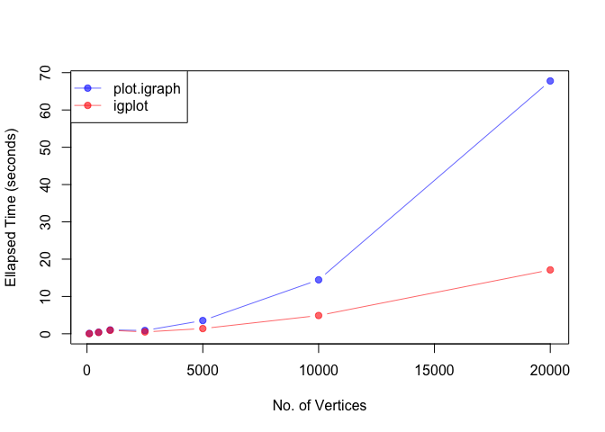

<!-- README.md is generated from README.Rmd. Please edit that file -->

# igplot

This is just a simple wraper around the `base::plot` function to create
network plots faster than `igraph`.

## Installation

You can install `igplot` with:

``` r
remotes::install_github("baruuum/igplot")
```

## Usage

``` r
library(igplot)

# make graph
set.seed(123)
g = igraph::erdos.renyi.game(10, .35)

# make plot with igraph package
set.seed(42)
tictoc::tic()
plot(g, layout = igraph::layout_with_fr)
```


``` r
tictoc::toc()
#> 0.026 sec elapsed
```

``` r
# make same plot with igplot
set.seed(42)
tictoc::tic()
igplot(
    g, 
    layout = "layout_with_fr", 
    plot_opts = list(
        v_cex = 2, 
        e_lwd = .8
    )
)
```



``` r
tictoc::toc()
#> 0.024 sec elapsed
```

`igplot` should be faster than `plot.igraph` especially for larger
graphs:

``` r
g = erdos.renyi.game(5000, .05)
tictoc::tic()
pdf("images/plot1.pdf", width = 6, height = 5)
plot(g, layout = layout_with_fr)
dev.off()
#> quartz_off_screen 
#>                 2
tictoc::toc()
#> 17.652 sec elapsed

tictoc::tic()
igplot(
    g, 
    layout = "layout_with_fr", 
    bg = "white", 
    outfile = "images/plot2.pdf",
    width = 6,
    height = 5,
    return_dat = FALSE
)
tictoc::toc()
#> 5.603 sec elapsed
```

See vignette for more examples.
