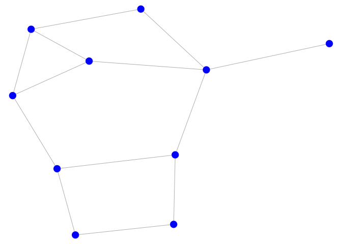

<!-- README.md is generated from README.Rmd. Please edit that file -->

# igplot

<!-- badges: start -->

[](https://github.com/baruuum/igplot/actions)

<!-- badges: end -->

The `igplot` package offers a simplified version of the `plot.igraph`
that creates network plots from `igraph` objects. The main function
provided by the package is, unsurprisingly, `igplot::igplot` which is a
wrapper around the `base::plot` function.

## Installation

You can install `igplot` with:

``` r
remotes::install_github("baruuum/igplot")
```

## Basic Usage

The package is designed to plot `igraph` objects faster than the
`igraph::plot.igraph` function. This means that less options are
available. However, for moderate to large graphs, the `igplot` function
should be faster than the `plot.igraph` function.

The basic usage of the package is described below:

Instead of using the `plot` method for `igraph` objects,

``` r
library(igplot)

# make graph
set.seed(123)
g = igraph::erdos.renyi.game(10, .35)

# make plot with igraph package
set.seed(42)
plot(
    g, 
    layout = igraph::layout_with_fr, 
    vertex.color = "blue", 
    vertex.label = NA, 
    vertex.size = 5
)
```


you can use the `igplot` function, where plotting options are specified
as a `list` with the `plot_opts` option.

``` r
# make same plot with igplot
set.seed(42)
igplot(
    g, 
    layout = "layout_with_fr", 
    plot_opts = list(
        v_cex = 2, 
        e_lwd = .8
    )
)
```



The available plotting options can be found by typing `?igplot::igplot`.

## Speed comaprison

Here’s a short speed comparison between these two functions run on MacOS
with a 2.4 GHz 8-Core Intel Core i9 processor:

``` r
compare_plot = function(n) {
    
    g = igraph::erdos.renyi.game(n, .01)
    
    set.seed(111)
    tictoc::tic()
    pdf("tmp.pdf", width = 5, height = 5)
    plot(g, layout = igraph::layout_with_fr) 
    dev.off()
    x = tictoc::toc(quiet = TRUE)
    
    set.seed(111)
    tictoc::tic()
    igplot(g, layout = "layout_with_fr", outfile = "tmp.pdf", width = 5, height = 5)
    y = tictoc::toc(quiet = TRUE)
    
    return(c(igraph = x$toc - x$tic, igplot = y$toc - y$tic))
    
}

# create plots of different sizes
gsize = c(100, 500, 1000, 2500, 5000, 10000, 20000)
res = sapply(gsize, compare_plot)

# colors
cols = c(scales::alpha("blue", .6), scales::alpha("red", .6))

# create graph
par(mfrow = c(1, 1))
plot(gsize, type = "n", xlim = c(min(gsize), max(gsize)), ylim = c(0, max(res)),
     xlab = "No. of Vertices", ylab = "Ellapsed Time (seconds)")
points(gsize, res[1, ], pch = 19, col = cols[1], type = "b")
points(gsize, res[2, ], pch = 19, col = cols[2], type = "b")
legend("topleft", c("plot.igraph", "igplot"), lty = 1, col = cols, pch = 19)
```


## Other Functionalities

The `igplot` package provides also some functions to rotate graphs in
order to make them comparable and functions to plot subsets of the
vertices. See vignette by typing `vignette("igplot")` into the `R`
console for more examples.
